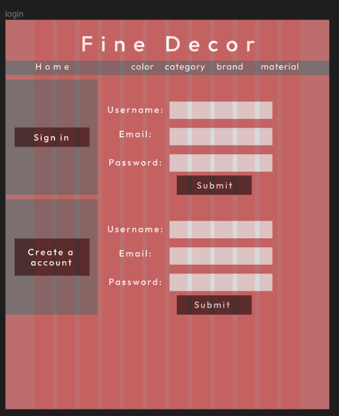
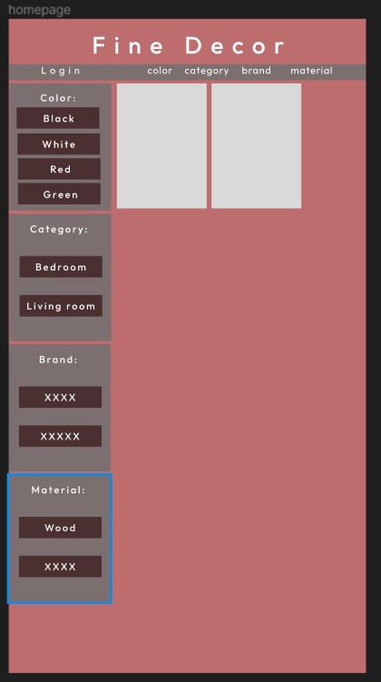
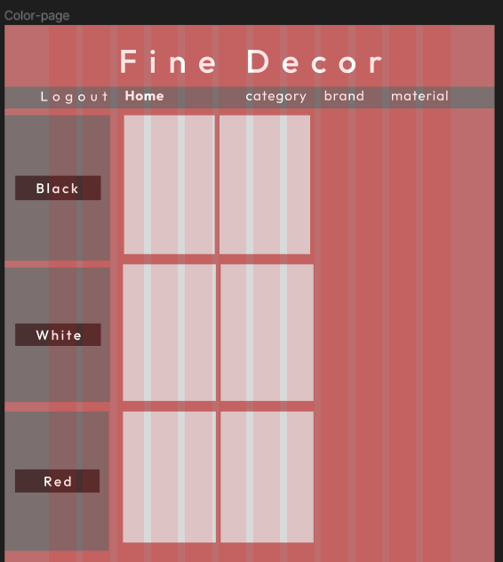

# FineDecor

## Description

We wanted to try and create a furniture store with a new way to shop for furniture, mainly being able to search for furniture in non traditional ways. If you've ever searched for furniture before you'd know it can be difficult to find *exactly* what you want. What we were thinking was to add an option to filter by color and/or material to really get to what you want right away. Instead of the traditional way of going from outdoors -> tables -> checking all the table colors to find the right one. Instead you would just outdoors -> color/material making it much more intuitive to search.

## Table of Contents

- [Installation](#installation)
- [Usage](#usage)
- [Credits](#credits)
- [License](#license)
- [Features](#features)

## Installation

If you want to contribute to this repo you will need NodeJS and MySQL. 
- Download/Fork the project
- In your terminal run ```mysql -u [your db user] -p``` 
- Inside of MySQL run ```source db/schema.sql```
- In a bash terminal run ```npm run seed``` to seed the db.
- To start the server in a bash terminal run ```npm start```

Download [NodeJS](https://nodejs.org/en/download).<br>
Download [MySQL](https://dev.mysql.com/downloads/installer/).

## Usage

To search for furniture in a more intuitive way allowing users to find exactly what they are looking for rather than searching endlessly for the correct color/style/material. We allow the user to sort/searchby these conditions ontop of the standard of bathroom/outdoor/bedroom ect ... Making it much easier to find exactly what you are looking for.

## Credits

Main contributors are:
- [Jiasi Li](https://github.com/Jiasisi)
- [Amanda Edmond](https://github.com/AmyEdmond)
- [Matt Zhao](https://github.com/unbmattzhao)
- [Justin Connors](https://github.com/Justin-Connors)

## Features

- Search for furniture
- Sort furniture
- Add furniture to cart
- User accounts/login

## Questions?

- Here's my GitHub: [Amanda Edmond](https://github.com/AmyEdmond) <br>
- Here's my Email: [e_amy0587@hotmail.com](mailto:e_amy0587@hotmail.com)

## License


---

## Initial Wireframe


